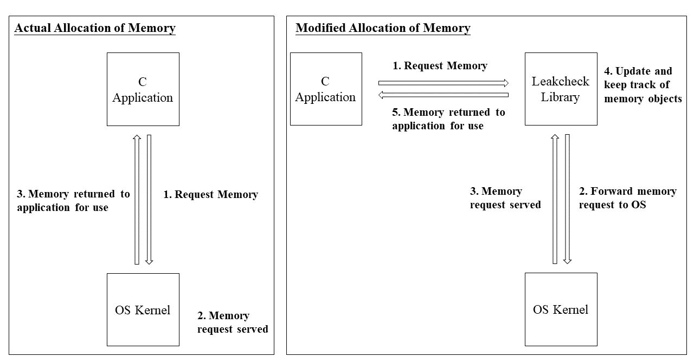
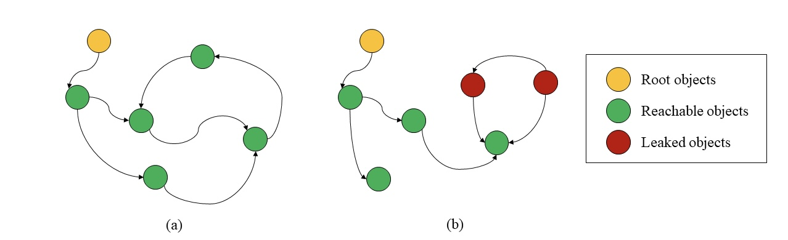
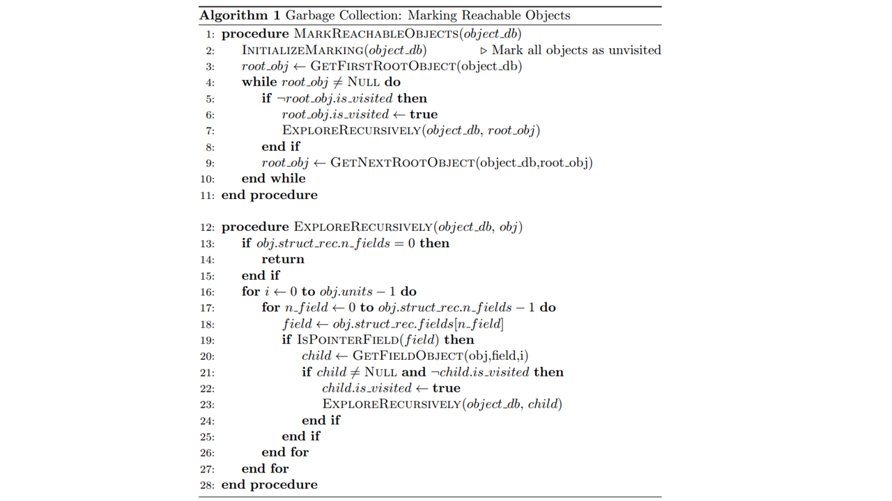

# LeakCheck: A Memory Leak Detection Library for C

LeakCheck is a dedicated memory leak detection library designed for C applications. It provides an automated approach to identify memory leaks that can often go undetected, thereby improving the performance and reliability of applications.

## Problem Statement

Traditional memory allocation mechanisms in C do not provide built-in leak detection, which can lead to inefficient memory use and unstable applications. LeakCheck addresses this issue by intercepting memory allocation and providing detailed tracking and analysis to pinpoint leaks.


*Figure 1: Comparison of actual allocation of memory and modified allocation with LeakCheck.*

## How It Works

### Architecture

LeakCheck is built on a architecture that involves a Struct DB and Object DB, working together to monitor and record memory allocation and deallocation events. This setup lays the groundwork for the leak detection algorithms that follow.


*Figure 2: Library pipeline breakdown illustrating the components of LeakCheck.*

### Directed Cyclic Graph and Leak Detection
The library utilizes a directed cyclic graph (DCG) model to represent memory allocations, where nodes represent allocated objects, and edges represent references between them. The garbage collection algorithm then analyzes these graphs to detect any objects that are no longer reachable, which are potential memory leaks.


*Figure 3: (a) Directed cyclic graph without any leaked objects; (b) Directed cyclic graph with leaked objects.*

#### DFS Algorithm

The core of LeakCheck's functionality is its Depth-First Search (DFS) detection algorithm. By traversing the object graph constructed by the library, the algorithm can flag objects that are no longer accessible from any root references.


*Figure 4: The algorithm used by LeakCheck for detecting memory leaks.*

## Getting Started

To integrate LeakCheck into your C application, follow these steps:

```bash
# Clone the LeakCheck repository
git clone [Repository URL]

# Navigate to the LeakCheck directory
cd LeakCheck

# Compile the library
make all

# Run the test cases provided
make run